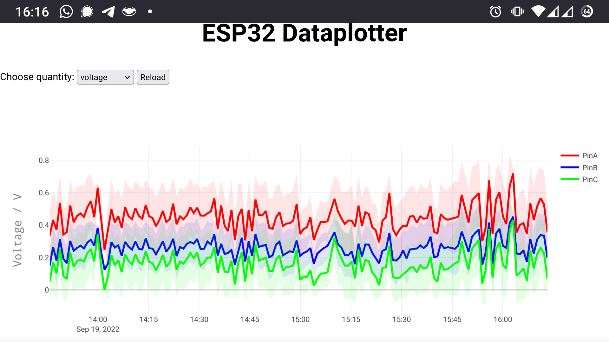
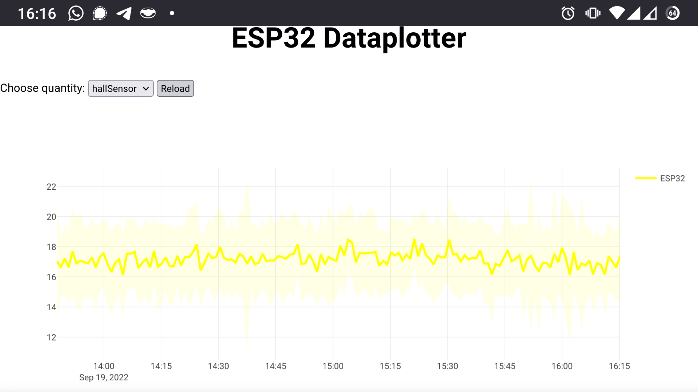

# ESP32 DataPlotter
This Arduino IDE sketch allows to log data recorded by sensors using an ESP32 on its flash memory. The ESP32 acts as a server in the local WiFi, presenting interactive plots of the recorded data using [plotly.js](https://plotly.com/javascript/).

## Demo Screenshots



## Prerequisites
* [Arduino IDE 1.x](https://www.arduino.cc/en/software) with the [Espressif board manager](https://espressif-docs.readthedocs-hosted.com/projects/arduino-esp32/en/latest/installing.html) installed
* [ESP32FS Plugin](https://github.com/me-no-dev/arduino-esp32fs-plugin) (Not yet compatible with Arduino IDE 2.0)
* [ESPAsyncWebserver](https://github.com/me-no-dev/ESPAsyncWebServer) library

## How to setup your own dataplotter
### How the `ESP32_DataPlotter.ino`-sketch works:
1. Substitute with your WiFi credentials:
```
/*BEGIN USER CODE - WIFI (Replace with your network credentials)*/
const char* ssid = "REGOSH";
const char* password = "Libre2022";
const char* DataloggerName = "dataplotter";
/*END USER CODE - WIFI*/
```
2. Insert the libraries for your sensors, if any:
```
/*BEGIN USER CODE - USER LIBRARIES*/
...
/*END USER CODE - USER LIBRARIES*/
```
3. Define your global objects, if necessary:
```
/*BEGIN USER CODE - GLOBAL DECLARATIONS*/
...
/*END USER CODE - GLOBAL DECLARATIONS*/
```
4. Specify the total number of parameters that you want to log, as well as their names. Make sure to add a backslash `\` in front of each parameter name. (This variable will be used as the URL of the associated GET request.) For instance like this:
```
/*BEGIN USER CODE - NAMES OF PARAMETERS*/
const int NumberOfParameters = 4;
const char* ParameterNames[NumberOfParameters] = {"/voltagePinA", "/voltagePinB", "/voltagePinC", "/hallSensorESP32"};
/*END USER CODE - NAMES OF PARAMETERS*/
```
5. The constructor of the `LogNPlot`-class takes the array of the parameter names, the total number of parameters, your WiFi SSID, your WiFi password and the dataplotter name chosen by you. It sets up an [`ESPAsyncWebServer`](https://github.com/me-no-dev/ESPAsyncWebServer) that serves the `index.html` page and sets up the hidden infrastructure.
```
LogNPlot logger(ParameterNames, NumberOfParameters, ssid, password, DataPlotterName);
```
6. In `setup`, after calling the setup routine of each of your sensors (here represented by configuration of the `pinMode`), you can start the data plotter using its `.begin()` method. Like this:
```
void setup(){
  // Serial port for debugging purposes
  Serial.begin(115200);
  serialIncFlush();
  serialOutFlush();
  /*BEGIN USER CODE - SETUP*/
  pinMode(32,INPUT);
  pinMode(33,INPUT);
  pinMode(34,INPUT);
  /*END USER CODE - SETUP*/
  logger.begin();
}
```
7. From the `loop` method, we call the actual measurement method. Once for each sample. By default, the dataplotter provides two configurations: Taking a sample every 2 seconds over a period of 1 minute. (activate this mode by acessing <http://dataplotter.local/quick>). Or taking a sample every 5 seconds over a period of 10 minutes. (activate this mode by acessing <http://dataplotter.local/slow>)
```
void loop(){
  logger.checkConnection();
  for(int i=0; i < logger.MeasurementPeriod/(2*logger.SamplingPeriod); i++){
    measure_all();
  }
  time_t timeRightNow;
  time(&timeRightNow);
  for(int i=0; i < logger.MeasurementPeriod/(2*logger.SamplingPeriod); i++){
    measure_all();
  }
  logger.saveMeasurement(timeRightNow);
}
```
8. In the `measure_all`-method, pack your measurement procedure that you would like to carry out for each sample. Take the below snippet as an example for analog voltage measurement, together with the built-in hall sensor of the ESP32 for added complexity:
```
void measure_all(){
  long t1 = millis();
  /*BEGIN USER CODE - Measuring a sample.*/
  int adc1, adc2, adc3;
  adc1 = analogRead(32);
  adc2 = analogRead(33);
  adc3 = analogRead(34);
  logger.addSampleAtPosition(adc1*0.000806,0);
  logger.addSampleAtPosition(adc2*0.000806,1);
  logger.addSampleAtPosition(adc3*0.000806,2);
  Serial.println("ADC: " + String(adc1) + " , " + String(adc2) + " , " + String(adc3));
  int hallValue;
  hallValue = hallRead();
  logger.addSampleAtPosition(hallValue,3);
  Serial.println("Hall Sensor: " + String(hallValue));
  /*END USER CODE - Measuring a sample.*/
  long t2 = millis();
  if(logger.SamplingPeriod*1000-(millis()-t1) > 0) delay(logger.SamplingPeriod*1000-(t2-t1));
}
```
Here, every value is added with its respective position value using the the method `.addSampleAtPosition(value,position)`.
9. That's it! Happy datalogging!

### Adapt the `index.html` to your needs:
The `index.html` page is stored in the flash memory of the Arduino. After adapting it to your needs, you will need to upload it to the flash memory of the ESP32, using the "ESP32 Sketch Data Upload" button.
1. Update the option list for the different quantities that you would like to plot:
```
<form method="GET" action="/" align="center">Choose quantity:
  <select id="quantity">
<!--  We can list as many options as desired. Here, we display the /voltagePinA, /voltagePinB and /voltagePinC values in a single graph. See below.-->
    <option value="/voltage">voltage</option>
    <option value="/hallSensor">hallSensor</option>
  </select>
  <button type="button" onclick="reload()">Reload</button>
</form>
```
2. In the middle of the `index.html` file, inform all your parameters, grouped into quantities:
```
  // Per physical quantity, such as voltage, there might be several curves to be plotted. We can add varies quantities.. See the example below
  const block = { 'voltage':{'PinA': 'rgb(255,0,0)', 'PinB': 'rgb(0,0,255)', 'PinC': 'rgb(0,255,0)'}, 'hallSensor' :{'ESP32': 'rgb(255,255,0)'}};
```
The parameters are formed like this \<quantity\>+\<identifier\> = \<parameter\>. For instance, "voltage" and "PinA" yields "voltagePinA", which represents the "/voltagePinA" GET request that we defined in the ```ESP32_DataPlotter.ino```-sketch. In this way, each parameter is given its own color, specified as rgb value.
3. At the bottom of the `index.html` file, you can relabel the axes according to the quantity that is plotted:
```
  switch(selecter.options[selecter.selectedIndex].text) {
    // If more than one quantity is used, the axes can be adapted as desired.
    case "voltage":
      Plotly.relayout(graph, { 'yaxis.title.text': 'Voltage / V', 'yaxis.type': 'linear' });
      break;
    case "hallSensor":
      Plotly.relayout(graph, { 'yaxis.title.text': '', 'yaxis.type': 'linear' });
      break;
  }
```
4. Upload the ```index.html```into the flash memory of the ESP32 using the "ESP32 Sketch Data Upload" button. (Note that the serial monitor has to be closed for a successful upload!)
5. That's it! Have fun modifying!
### Access <http://dataplotter.local> in your webbrowser (or which name you defined in the ```ESP32_DataPlotter.ino```-sketch) and admire the beauty of your data!
